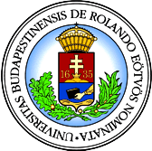

## Hello, I'm Ulas!

### Education

| | | | |
|:--:|:--:|:--:|:--:|
| | [Columbia University](https://www.columbia.edu/) | M.S. in Computer Science | 2022-2023 |
| | [Eötvös Loránd University](https://www.elte.hu/en/) | B.S. in Computer Science | 2017-2021 |

### Projects

All my projects and contributions can be found on my [GitHub](https://github.com/ulasonat).

### Activity Status

<!--
**ulasonat/ulasonat** is a ✨ _special_ ✨ repository because its `README.md` (this file) appears on your GitHub profile.

Here are some ideas to get you started:

- 🔭 I’m currently working on ...
- 🌱 I’m currently learning ...
- 👯 I’m looking to collaborate on ...
- 🤔 I’m looking for help with ...
- 💬 Ask me about ...
- 📫 How to reach me: ...
- 😄 Pronouns: ...
- ⚡ Fun fact: ...
-->
